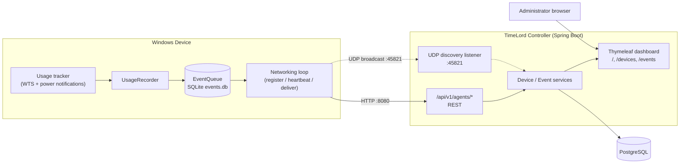

# TimeLord Phase 1 Architecture

> **Phase 1 is monitoring only.** There is no schedule engine, session-limit
> enforcement, mandatory-break logic, or remote power control — TimeLord
> observes and reports what's happening on each device; it doesn't act on it
> yet. See [What's implemented](#whats-implemented) below.

> **Phase 1 is also deliberately unsecured.** Plain HTTP, no authentication, no
> request signing, no access control. It exists to prove the shape of the
> system — discovery, registration, heartbeats, events — on a trusted local
> network, ahead of a later security phase. See
> [Security boundary](#security-boundary) below before running this anywhere
> else.

## Summary

TimeLord Phase 1 has three moving pieces:

- **TimeLord Agent** (Rust) — runs on each Windows device as a service. Tracks
  when the device is actually in use (not just powered on — see
  `agent/README.md`), who's logged in, and every network adapter (name/MAC/
  address). Finds a controller (explicit URL or UDP discovery), registers, and
  reports usage/lifecycle events and heartbeats.
- **TimeLord Controller** (Java 21 / Spring Boot) — the single source of truth.
  Accepts registration/heartbeats/events over HTTP, listens for UDP discovery
  requests, persists everything to PostgreSQL, computes each device's status,
  and serves both the REST API and a server-rendered (Thymeleaf) admin
  dashboard.
- **PostgreSQL** — durable storage for devices, events, and heartbeats.

The agent never loses an event to a controller outage: every event is written
to a local SQLite queue *before* any delivery attempt, and only removed once
the controller acknowledges it (including an acknowledged *duplicate*, which
counts as delivered). Time-sensitive events (agent shutdown, reconnecting
after being offline) flush immediately rather than waiting for the next
scheduled retry.

## What's implemented

- **Device registration, heartbeats, event ingestion** over the Phase 1 HTTP
  API, with idempotent event submission (see
  [Event delivery and idempotency](#event-delivery-and-idempotency)).
- **Two independent statuses per device**, shown on the dashboard:
    - **Online / Offline** — is the agent reachable (heartbeat recency)?
    - **Active** — is a user actually logged in right now (`Device.isActive()`
      — online *and* a current user reported over heartbeat)?
- **Login sessions** — a per-device history of login → logout spans
  (`DeviceSessionService`), reconstructed at read time from `USER_LOGON` /
  `USER_LOGOFF` / `AGENT_STOPPING` / `SYSTEM_SUSPEND` / `HEARTBEAT_SENT`
  events rather than stored in a separate table. A device that's merely
  online with nobody logged in — including right after the agent starts —
  has no session at all; only an actual logon starts one, and logoff, agent
  shutdown, suspend, or the agent going silent for too long ends it.
- **Network interface inventory** — every adapter the OS reports (not just
  ones with a routable address), with name, MAC, and address(es), shown on
  the device detail page.
- **Admin dashboard** — device list with live status, per-device detail, and
  a searchable/filterable event log.

Not implemented: schedules, session-limit enforcement, mandatory breaks,
connectivity requirements, remote power control, or any policy engine —
despite what the root README's tagline aspires to.

## Component diagram



## Discovery sequence

Active discovery (the primary mechanism) vs. the explicit-URL path both feed
into the same registration flow:

```mermaid
sequenceDiagram
    participant Agent
    participant Controller

    alt controller.url configured
        Agent->>Agent: use configured URL directly
    else no URL configured
        Agent->>Controller: UDP broadcast DISCOVER_CONTROLLER (requestId)
        Controller-->>Agent: UDP unicast CONTROLLER_AVAILABLE (same requestId)
        Note over Agent: validate protocol/version/requestId/URL;<br/>if multiple replies, pick by priority,<br/>then speed, then smallest controller ID
        Agent->>Agent: persist chosen URL to agent.toml
    end

    Agent->>Controller: POST /api/v1/agents/register
    Controller-->>Agent: 200 { deviceId, controllerId, heartbeatIntervalSeconds }
    loop every heartbeatIntervalSeconds
        Agent->>Controller: POST /api/v1/agents/{deviceId}/heartbeat
    end
    loop every eventRetryIntervalSeconds
        Agent->>Controller: POST /api/v1/agents/{deviceId}/events (batch)
        Controller-->>Agent: ACCEPTED / DUPLICATE / REJECTED per event
    end
```

UDP broadcast only reaches devices in the same broadcast domain, and Docker's
bridge network typically doesn't forward broadcast traffic to a published
UDP port at all — see [Known limitations](#known-limitations). The explicit
`controller.url` path always works and is what `.env.example` sets up by
default.

## Event delivery and idempotency

- Every event gets a client-generated `eventId` (UUID). The controller uses it
  as the primary key of `device_event`, so retransmitting the same event is
  safe: the second submission is reported as `DUPLICATE`, not inserted again.
- The agent's local queue (`events.db`) treats `DUPLICATE` the same as
  `ACCEPTED` — both remove the event from the local queue.
- A failed submission schedules a retry with bounded backoff (10s, 30s, 1m,
  5m, 15m, 30m, holding at 30m), and an event that fails
  [`MAX_ATTEMPTS`](https://github.com/johnjoeallen/timelord/blob/main/agent/src/queue.rs) times is discarded rather than
  retried forever.

## Security boundary

This phase intentionally has:

- No TLS (plain `http://`)
- No authentication of agents or administrators
- No request signing or replay protection
- No access control on any endpoint

**Only run this on an isolated or trusted local network.** The code is
structured so a later phase can add HTTPS, controller-key pinning, Ed25519
agent identity, signed events, and role-based admin access without rewriting
the event model:

- Controller: `AgentRequestAuthenticator` (`common/AgentRequestAuthenticator.java`)
  — ships only `NoOpAgentRequestAuthenticator`.
- Agent: `RequestSigner` trait (`controller_client.rs`) — ships only
  `NoOpRequestSigner`.

## Known limitations

- **Docker + UDP broadcast**: a Windows agent on the LAN broadcasting to
  `255.255.255.255:45821` generally will not reach a controller published
  from inside Docker's default bridge network — Docker's NAT forwards
  packets addressed to the host's specific IP, not to the broadcast address.
  Use the explicit `controller.url` (Mode A) for anything beyond same-host
  experimentation, or run the controller directly on the host for discovery
  testing. `TIMELORD_PUBLIC_URL` must be a LAN-reachable address, never the
  in-Docker hostname `controller`.
- **`TIMELORD_PUBLIC_URL`** is what gets handed to agents during discovery and
  registration responses; it must be reachable from agent devices, which
  `.env.example` calls out.
- **OS version detection** is a placeholder (`agent_version`/architecture are
  real; `operatingSystemVersion` is not populated yet) — see `agent.rs::os_info`.
- **No persisted `device_session` table yet** — `EventItem.sessionId` is
  always `null` in Phase 1; the OS-level Windows session ID is carried in
  `data.windowsSessionId` instead. The dashboard's "User sessions" list (see
  [What's implemented](#whats-implemented)) is reconstructed at read time
  from the event log by `DeviceSessionService`, not backed by a session
  table — that's still a later phase.
- **Login sessions are single-user-at-a-time per device** — the agent caches
  one username per Windows session ID, but the controller's session/active
  model doesn't distinguish concurrent logons (fast user switching, RDP).
- **No idle-time detection** — a Session-0 service can't call
  `GetLastInputInfo` for the interactive desktop; heartbeats currently send
  `idleSeconds: null`. See `agent/README.md`.
