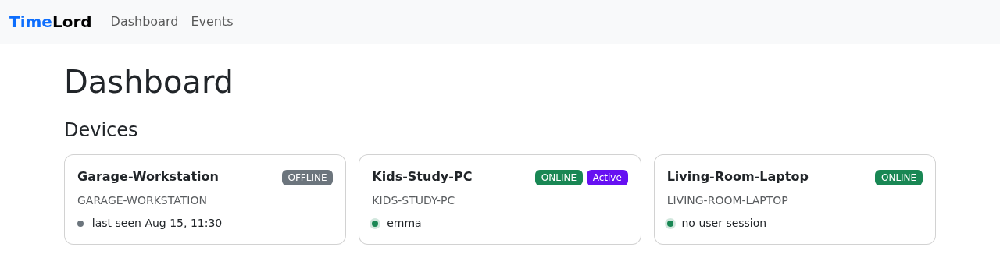
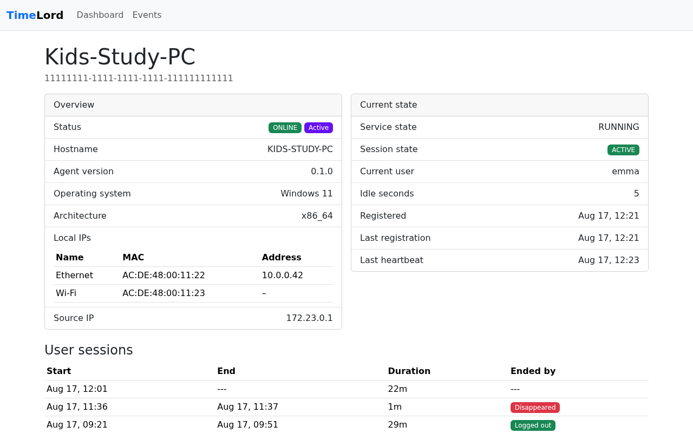

# TimeLord

TimeLord tracks how Windows devices on your network are actually being used — who's logged in,
for how long, and whether the machine is even reachable — and shows it on a live dashboard.

!!! warning "Phase 1 is monitoring only"
    Nothing in this build enforces anything. There's no schedule engine, no session-limit
    enforcement, no forced breaks, and no remote power control — the [`README`](https://github.com/johnjoeallen/timelord#readme)
    tagline about "securely enforcing schedules" describes the eventual project, not what's
    running today. Today, TimeLord **observes and reports**: it tells you what's happening, it
    doesn't act on it. It also runs over plain, unauthenticated HTTP — see
    [Security boundary](architecture.md#security-boundary) before running it anywhere but a
    trusted local network.

## What it actually does today

- **Windows agent** (Rust service) watches Windows session/power notifications — logon, lock,
  unlock, logoff, console/RDP connect and disconnect, suspend, resume — and the currently
  logged-in user (including one already logged in when the service starts), and reports them to
  a controller. Every event is queued to local disk before delivery, so a controller outage never
  loses data; queued events retry with backoff and flush immediately on reconnect or shutdown.
- **Controller** (Java / Spring Boot / PostgreSQL) accepts registration, heartbeats, and events
  over HTTP, and computes two independent statuses per device:
    - **Online / Offline** — is the agent reachable (recent heartbeats)?
    - **Active** — is a user actually logged in right now?
- **Login sessions** — a per-device history of login → logout spans, derived from the event log,
  distinct from "the agent was running." Starting the service with nobody logged in shows the
  machine online but produces no session at all.
- **Dashboard** — a server-rendered admin UI: device list with live status, per-device detail
  (network interfaces, current user, login history), and a searchable event log.

## Screenshots

<figure markdown>
  
  <figcaption>The dashboard distinguishes three states per device: offline, online with someone
  logged in ("Active"), and online with nobody logged in.</figcaption>
</figure>

<figure markdown>
  
  <figcaption>Device detail: live status, every network adapter (name/MAC/address), and login
  session history with how each one ended.</figcaption>
</figure>

## Get started

TimeLord runs as two containers — `postgres` + `controller` — via `docker compose`:

```console
$ cp .env.example .env        # edit TIMELORD_PUBLIC_URL to your LAN IP
$ docker compose up --build   # postgres + controller on :9099, discovery UDP on :45821
```

Open `http://localhost:9099` for the dashboard. See the
[root README](https://github.com/johnjoeallen/timelord#readme) for the full quick start,
including trying the agent's dev backend without a Windows box.

## Components

| Component         | Path          | Language                    | What it does |
|--------------------|---------------|------------------------------|----------------|
| TimeLord Agent     | `agent/`      | Rust (Windows service)       | Tracks usage sessions and reports them |
| TimeLord Controller| `controller/`| Java 21 / Spring Boot        | Registration, heartbeats, events, dashboard |
| TimeLord Protocol  | `protocol/`  | JSON Schema                  | Not yet populated |

## Further reading

- [Architecture](architecture.md) — component diagram, discovery/registration sequence, event
  delivery and idempotency, security boundary, known limitations
- [`agent/README.md`](https://github.com/johnjoeallen/timelord/blob/main/agent/README.md) —
  agent internals, CLI, local dev workflow
- [`controller/README.md`](https://github.com/johnjoeallen/timelord/blob/main/controller/README.md) —
  controller internals, API, running tests
